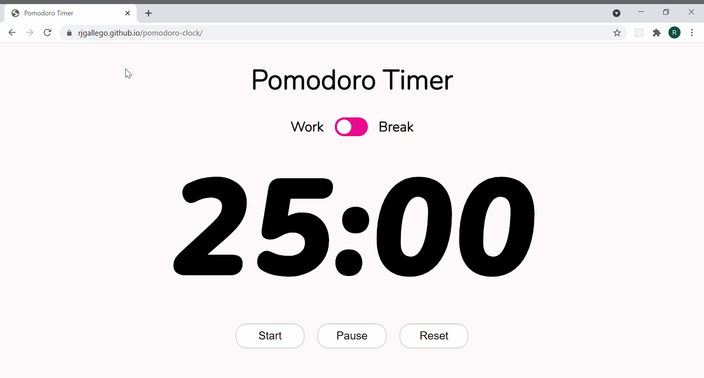

# Pomodoro Timer
### A Pomodoro Timer written in HTML, CSS, and Javascript
Try it out [here!](https://rjgallego.github.io/pomodoro-clock/)

### Summary
This Pomodoro Timer was written purely in CSS, HTML, and Javascript, with some fonts from fonts.google.com. You can set the timer to Work (25min) or Break (5min). You can also pause, re-start, or reset the timer using the given buttons.

### Author
Rheanna Pena - [LinkedIn](https://www.linkedin.com/in/rheanna-gallego-aa0007110/)
